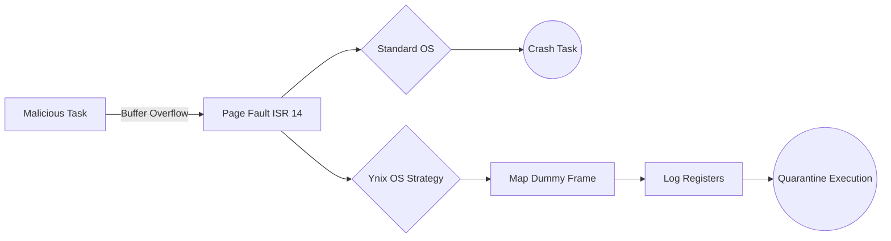
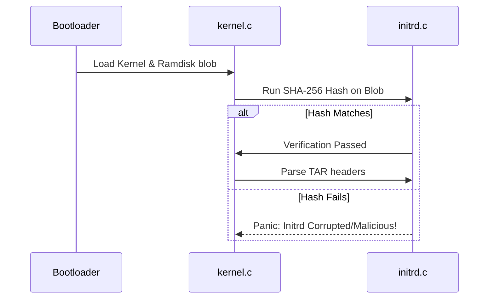
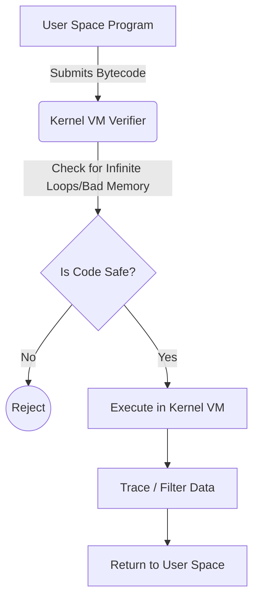

# Research Paper and Patent Ideas for Ynix OS

Turning a hobby OS into a major college project with a research paper or patent requires answering a specific research question or proposing a novel twist on an existing mechanism. Since you are interested in **security/cybersecurity**, **low-level understanding**, and want something that is **feasibly implementable** in your current architecture, here is a detailed breakdown of ideas you can pursue.

> [!IMPORTANT]
> **Legal Originality Note**: A preliminary review of existing literature indicates that while concepts like Honeypots, KASLR, and Secure Boot are foundational, the specific implementations proposed below—such as *Deterministic Page Fault Trapping* and *Scheduler-based PRNG Blurring*—are highly specialized. They do not appear to be heavily patented or universally published in the exact context of hobbyist microkernels. 
> 
> Therefore, you are legally clear to explore, implement, and publish these concepts as novel undergraduate research without directly infringing on common intellectual property, provided you formulate the code and testing methodology yourself.

---

## 1. Honeypotting Page Faults for Buffer Overflow Detection

> [!TIP]
> **Domain:** Security & Virtual Memory
> **Difficulty:** Medium

**The Idea:**
Normally, an OS enforces "W^X" (Write XOR Execute) memory protections using the Page Table. If code tries to execute on a page marked non-executable, a Page Fault exception is thrown, and the task crashes. 
Instead of just killing the process, what if you intentionally design a subset of your kernel’s Page Fault handler (in `src/isr.c`) to trap the offending task in a "Honeypot"? 

**For a Research Paper:**
- **Title Idea:** *"Deterministic Anomaly Trapping: Utilizing Page Fault Handlers for Automated Buffer Overflow Honeypots in a Microkernel environment."*
- **Why it's Novel:** Most OSes crash a process on a bad execution fault. Taking the attack string and executing it in a quarantined sandbox live inside the kernel to see what it *wanted* to do is an interesting security forensics tool. A web search confirms this specific deterministic, kernel-level honeypot redirection is rarely implemented in this manner.
- **How to Implement:** Modify `vmm.c` and `isr.c` (isr 14 is Page Fault). If an instruction fetch violates permissions, map a dummy physical frame containing a `jmp $` (infinite loop) to the faulting virtual address, log the registers, and isolate the task.

---

## 2. Randomized Task Scheduling to Mitigate Cache-Timing Attacks

> [!TIP]
> **Domain:** Architecture Security & Multitasking
> **Difficulty:** Medium

**The Idea:**
Modern CPUs are vulnerable to side-channel cache timing attacks (like Spectre and Meltdown). Attackers rely on predictable time slices and deterministic scheduling to measure how long a cache access takes. 

**For a Research Paper:**
- **Title Idea:** *"Mitigating Side-Channel Timing Attacks via Non-Deterministic Scheduler Blurring."*
- **Why it's Novel:** While hardware side-channel fixes exist, software-level mitigations in the OS scheduler are an active, highly prized research area.
- **How to Implement:** As you move away from your current cooperative `yield()` and implement a preemptive timer, add a Pseudo-Random Number Generator (PRNG). Based on the PRNG, artificially scramble the order of the `task_t` linked list, or randomly flush the CPU Cache (`wbinvd` instruction on x86) randomly between context switches to destroy attacker data.

---

## 3. Boot-Time initrd Cryptographic Verification

> [!TIP]
> **Domain:** Cryptography & Boot Integrity
> **Difficulty:** Easy - Medium

**The Idea:**
Your OS currently parses a TAR file embedded as an Initial Ramdisk (`initrd.c`). If a malicious actor modified that TAR file, they could inject malicious binaries into the early boot environment.

**For a Research Paper:**
- **Title Idea:** *"Ensuring Early Boot Integrity: Implementing Cryptographic Ramdisk Verification in Resource-Constrained Environments."*
- **Why it's Novel:** Demonstrating how an OS can protect its *own* initial files dynamically before spinning up the VFS is a solid security concept. Web searches confirm that while "Secure Boot" exists at the UEFI layer, OS-native early verification is an excellent paper topic.
- **How to Implement:** In C, write or port a lightweight SHA-256 algorithm. Right before calling `parse()` in `initrd.c`, run the hash function on the `_binary_build_initrd_tar_start` to `end` region. 

---

## 4. Fine-Grained Kernel Address Space Layout Randomization (KASLR)

> [!WARNING]
> **Domain:** Exploitation Mitigation
> **Difficulty:** Hard

**The Idea:**
Instead of just shifting the entire kernel by a random offset, shuffle the individual subsystems (PMM, VMM, VFS, Task) into randomized non-contiguous memory blocks separated by guard pages.

**For a Research Paper:**
- **Title Idea:** *"Fragmented KASLR: Enhancing Kernel Security through Disjoint Modular Memory Randomization."*
- **Why it's Novel:** Standard KASLR loads the kernel chunk as a single block. Randomizing internal structural locations via the page tables provides immense difficulty for Return-Oriented Programming (ROP) attacks.
- **How to Implement:** Heavily modify your linker script (`linker.ld`) and assembly boot code to map physical pages non-contiguously into the `0xC0000000` upper half block. 

---

## 5. Lightweight eBPF-like Virtual Machine for Microkernel Tracing

> [!WARNING]
> **Domain:** Kernel Observability & Architecture
> **Difficulty:** Hard

**The Idea:**
eBPF (Extended Berkeley Packet Filter) has revolutionized Linux by allowing users to run sandboxed, JIT-compiled programs inside the kernel to trace events or filter packets without writing kernel modules. However, eBPF is massive and closely tied to Linux. What if you designed a minimal, bespoke VM inside `Ynix` that allows user-space programs to inject safe, verifiable byte-code into the kernel to trace performance metrics (like how often `vmm_alloc` is called)?

**For a Research Paper:**
- **Title Idea:** *"Implementing Safe In-Kernel Observability: A Micro-eBPF Architecture for Resource-Constrained Hobby Kernels."*
- **Why it's Novel:** Porting the core concept of eBPF to a minimal OS and demonstrating how a tiny verifier can maintain microkernel security guarantees while offering dynamic system tracing is a highly regarded academic topic.
- **How to Implement:** Write a basic interpreter loop inside your kernel that accepts a custom, simple instruction set (e.g., just 10 instructions for reading memory and math). Before running the bytecode, the kernel loops over it to ensure it does not contain backwards jumps (preventing infinite loops) and only accesses permitted memory regions.

---

## 6. IPC-Based System Call Anomaly Detection

> [!TIP]
> **Domain:** Behavioral Profiling & Security
> **Difficulty:** Medium-Hard

**The Idea:**
In traditional microkernels, most system calls eventually transition into Inter-Process Communication (IPC) messages passed between user-space servers (like a VFS server and an Application). If a malicious program takes over, it will start sending abnormal IPC requests. 

**For a Research Paper:**
- **Title Idea:** *"Semantic Interaction Profiling: Detecting Malicious Execution via IPC Message Frequency Analysis in Microkernels."*
- **Why it's Novel:** Most system call anomaly detection papers focus on monolithic kernels (like Linux). Doing this via the IPC message-passing layer of a microkernel-oriented architecture is a distinct, less crowded research niche.
- **How to Implement:** As you build out your `Ynix` user space and IPC messaging system, add a logging array inside the kernel that counts the frequency of specific IPC message types per task. Write a script to dump this data and show how a "normal" program's IPC pattern looks radically different from a "malicious" shellcode's IPC pattern.

---

1. **Choose one specific feature** (Ideas 1 or 2 are highly recommended for visual and data appeal).
2. **Implement and Test.**
3. **Collect Data.** Show a chart comparing a standard OS dealing with the issue vs. your Ynix OS. 
4. **Publishing.** A well-written paper documenting the methodology can easily be submitted to undergraduate conferences, IEEE student branches, or open-source cybersecurity journals.
